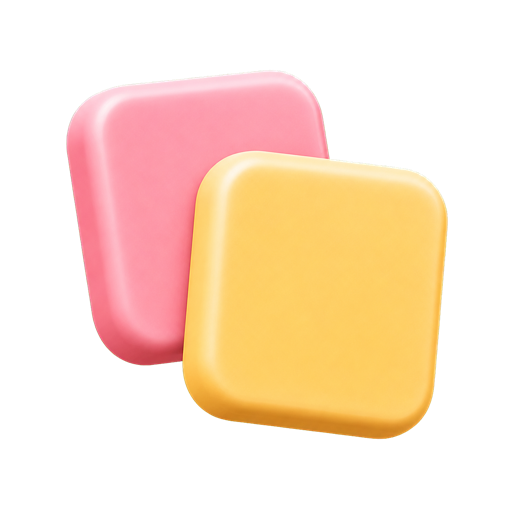
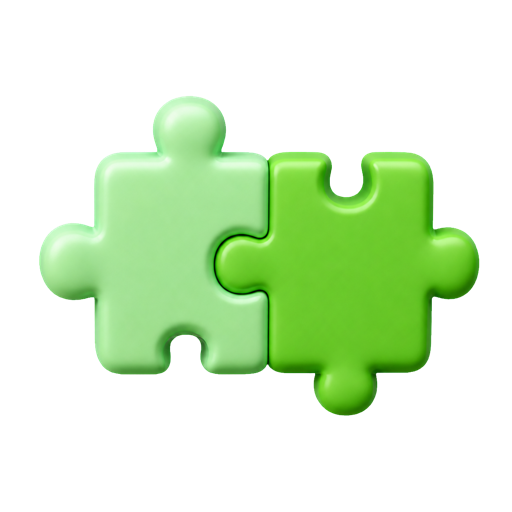
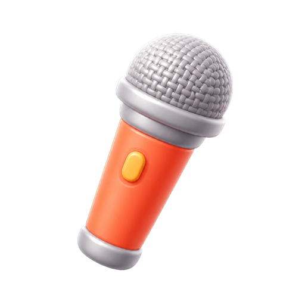

# 코스 아이콘 세 장 — 그림 생성 프롬프트

리포트의 코스 카드에서 ✓ 띠 왼쪽에 서는 그림입니다. 여섯 코스 중 셋은 이미
`reasons/` 의 「학습 동기」 그림을 그대로 씁니다 — 그 코스가 곧 그 이유라서,
같은 그림이어야 「이래서 배운다 → 그래서 이 코스」 가 이어지기 때문입니다.

| 코스 | 아이콘 | 상태 |
|---|---|---|
| 상황별 · 여행 | `reasons/travel.png` (여행 가방) | 있음 |
| 상황별 · 드라마 | `reasons/kpop.png` (슬레이트) | 있음 |
| 상황별 · 반말 수다 | `reasons/friend.png` (말풍선 둘) | 있음 |
| **한글 읽기** | — | **필요** |
| **핵심 패턴** | — | **필요** |
| **프리토킹** | — | **필요** |

없는 동안 그 세 카드는 ✓ 로 남습니다. 엉뚱한 그림을 대신 붙이지 않는 것이
규칙입니다 — 「그림 하나 = 코스 하나」 가 깨지면 있는 그림들까지 뜻을 잃습니다.

---

## 넣는 법

1. 512×512 PNG, 배경 투명으로 저장
2. `trial/assets/course-icons/` 에 `ic-hangul.png` · `ic-core.png` · `ic-free.png`
3. `trial/reports/trial-1-report.html` 의 `<div class="ico-src" hidden>` 안에 이 세 줄을
   그대로 붙입니다:

   ```html
   
   
   
   ```

   세 장이 다 나오기 전이라면 나온 것만 넣습니다 — 나머지는 계속 ✓ 로 남습니다.
4. 덱을 다시 패키징합니다 —
   `python3 interactive/build_lemonboard.py trial/reports/trial-1-report.html --out trial/lemonboard-build/trial-1-report`

---

## 공통 스타일 (세 장 모두 앞에 붙입니다)

기존 `reasons/*.png` 와 같은 결이어야 합니다. 한 장만 결이 다르면 그 카드가
튑니다.

```
A single 3D rendered icon in the soft-plastic "3D emoji" style of Microsoft Fluent
or Apple-style volumetric emoji. Smooth matte-plastic surfaces with gentle glossy
highlights, soft rounded edges and thick chunky proportions, subtle ambient
occlusion, no outlines and no line art. Rendered at a slight three-quarter angle,
tilted a few degrees, floating with a soft diffuse contact shadow beneath it.
Warm friendly saturated colours, clean studio lighting from the upper left.
Fully transparent background, single centred object with small even padding,
nothing cropped by the frame. Square 512x512. No text, no letters, no words,
no logos, no background scenery, no border.
```

## 한 장씩

### 1. `ic-hangul.png` — 한글 읽기

읽기를 뗀다는 코스입니다. 카드의 문장은 「거리 간판과 메뉴판을 소리 내어
읽어요」 이고, 카드 가운데 그림은 자음·모음 타일이 한 글자로 합쳐지는 장면입니다.
그러니 아이콘은 **글자 타일 한 조각**이 가장 곧게 읽힙니다.

```
[공통 스타일] + Subject: two chunky rounded 3D tiles like soft toy blocks, stacked
slightly overlapping at a three-quarter angle. The front tile is a warm cream-yellow,
the tile behind it a soft pink. Simple, chunky, toy-like blocks with rounded corners
and thick depth, like children's alphabet blocks. Leave the tile faces completely
blank — no characters, no symbols, no engraving.
```

> 타일 색(크림·핑크)은 우연이 아닙니다 — 한글 덱에서 자음 자리는 크림, 모음
> 자리는 핑크입니다. 아이콘이 그 색을 쓰면 첫 수업의 색을 리포트에서 미리 봅니다.
> 글자는 넣지 마세요. 생성 모델이 쓰는 한글은 거의 항상 깨집니다 — 필요하면
> 빈 타일에 나중에 우리가 얹습니다.

### 2. `ic-core.png` — 핵심 패턴

틀은 그대로 두고 한 자리만 갈아 끼우는 코스입니다. **끼워 맞추는 조각**이
그 일의 모양입니다.

```
[공통 스타일] + Subject: two chunky 3D interlocking puzzle pieces clicking together,
seen at a three-quarter angle. The left piece is a soft mint green, the right piece
a slightly deeper fresh green, one gently sliding into the other so the joint is
clearly visible. Thick rounded plastic pieces, toy-like and friendly.
```

> 대안: 3D 레고식 브릭 두 개가 맞물리는 그림. 퍼즐 쪽이 「한 자리가 딱 들어간다」
> 는 뜻에 더 가깝습니다.

### 3. `ic-free.png` — 프리토킹

생각과 이유까지 스스로 말하는 코스입니다. 말풍선은 이미 반말 수다(`friend.png`)가
쓰고 있으므로 **겹치면 안 됩니다**. 「내가 말한다」 쪽으로 갑니다.

```
[공통 스타일] + Subject: a chunky 3D handheld microphone standing upright at a
slight angle, with a rounded mesh head and a short thick body. Coral-orange body
with a light silver-grey mesh head and a small warm highlight. Friendly and toy-like,
not a realistic studio microphone.
```

> 대안: 말풍선 안에 전구가 켜진 그림(생각 → 말). 다만 `friend.png` 의 말풍선과
> 실루엣이 겹치므로, 굳이 고른다면 전구가 훨씬 크게 보이도록 해야 합니다.

---

## 받고 나서 확인할 것

- 배경이 정말 투명한지 (흰 판이 딸려 오면 초록 띠 위에서 흰 네모로 보입니다)
- 30×30 으로 줄여도 무엇인지 알아볼 수 있는지 — 카드에서 이 크기로 섭니다
- 여섯 장을 한 줄로 늘어놓았을 때 혼자 튀지 않는지 (진하기 · 각도 · 두께)
